# nIllustration of Prim’s Algorithm:

Consider the following graph as an example for which we need to find the Minimum Spanning Tree (MST).

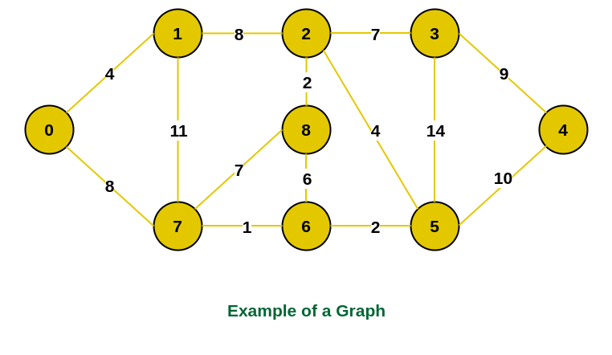

- Step 1: Firstly, we select an arbitrary vertex that acts as the starting vertex of the Minimum Spanning Tree. Here we have selected vertex 0 as the starting vertex.

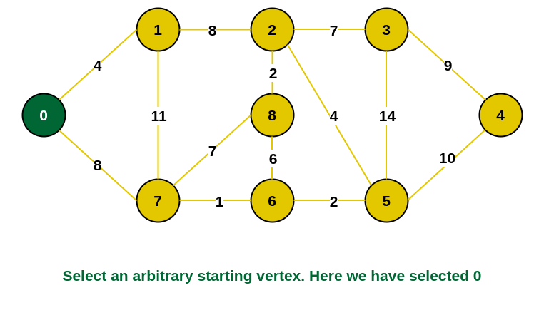

- Step 2: All the edges connecting the incomplete MST and other vertices are the edges {0, 1} and {0, 7}. Between these two the edge with minimum weight is {0, 1}. So include the edge and vertex 1 in the MST.

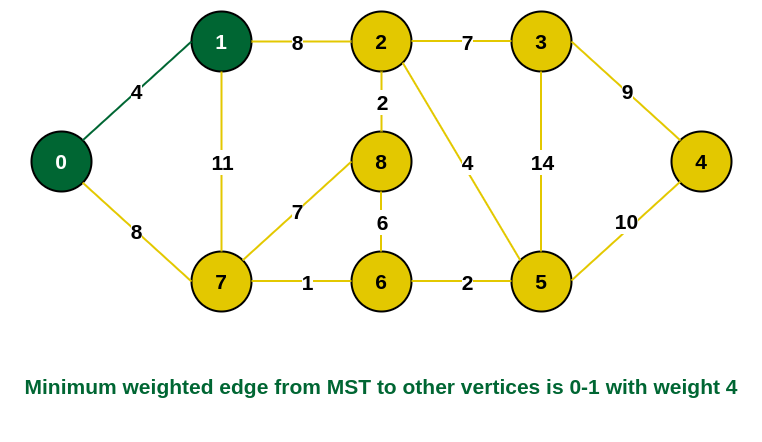

- Step 3: The edges connecting the incomplete MST to other vertices are {0, 7}, {1, 7} and {1, 2}. Among these edges the minimum weight is 8 which is of the edges {0, 7} and {1, 2}. Let us here include the edge {0, 7} and the vertex 7 in the MST. [We could have also included edge {1, 2} and vertex 2 in the MST]. 

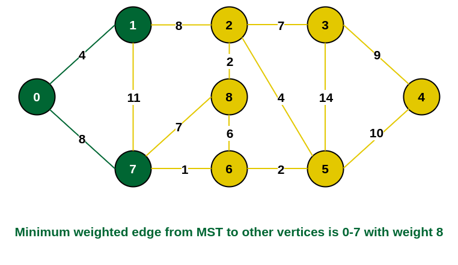

- Step 4: The edges that connect the incomplete MST with the fringe vertices are {1, 2}, {7, 6} and {7, 8}. Add the edge {7, 6} and the vertex 6 in the MST as it has the least weight (i.e., 1).

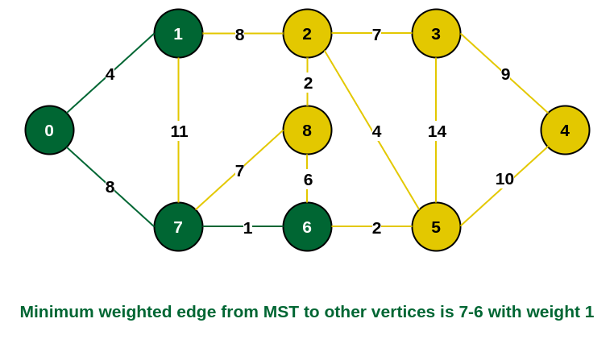

- Step 5: The connecting edges now are {7, 8}, {1, 2}, {6, 8} and {6, 5}. Include edge {6, 5} and vertex 5 in the MST as the edge has the minimum weight (i.e., 2) among them.

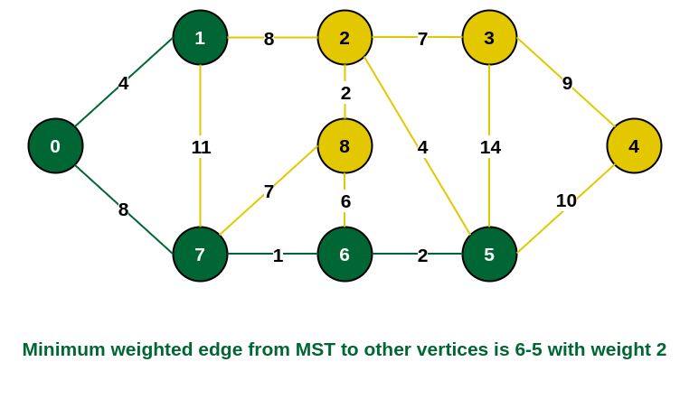

- Step 6: Among the current connecting edges, the edge {5, 2} has the minimum weight. So include that edge and the vertex 2 in the MST.

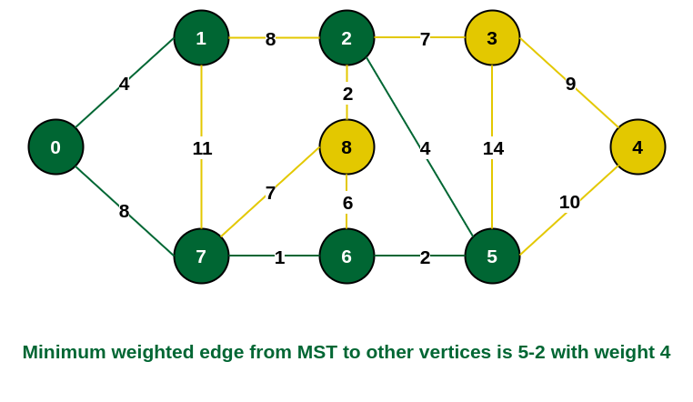

- Step 7: The connecting edges between the incomplete MST and the other edges are {2, 8}, {2, 3}, {5, 3} and {5, 4}. The edge with minimum weight is edge {2, 8} which has weight 2. So include this edge and the vertex 8 in the MST.

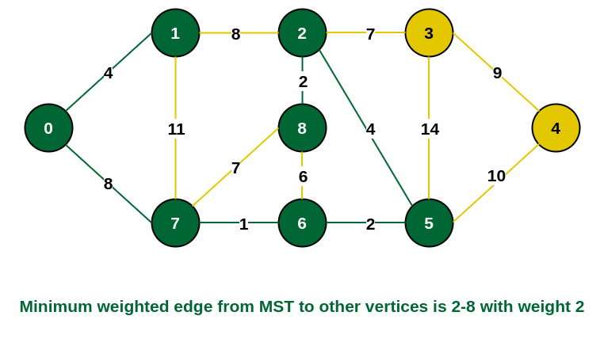

- Step 8: See here that the edges {7, 8} and {2, 3} both have same weight which are minimum. But 7 is already part of MST. So we will consider the edge {2, 3} and include that edge and vertex 3 in the MST.

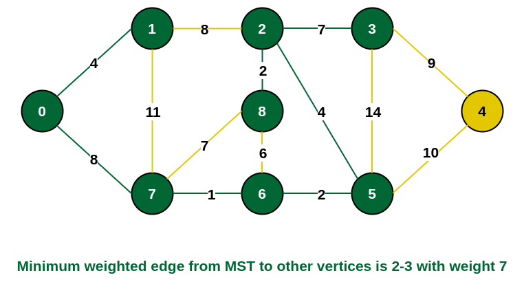

- Step 9: Only  the vertex 4 remains to be included. The minimum weighted edge from the incomplete MST to 4 is {3, 4}.

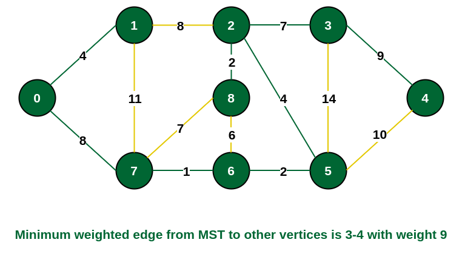

## The final structure of the MST is as follows and the weight of the edges of the MST is (4 + 8 + 1 + 2 + 4 + 2 + 7 + 9) = 37.

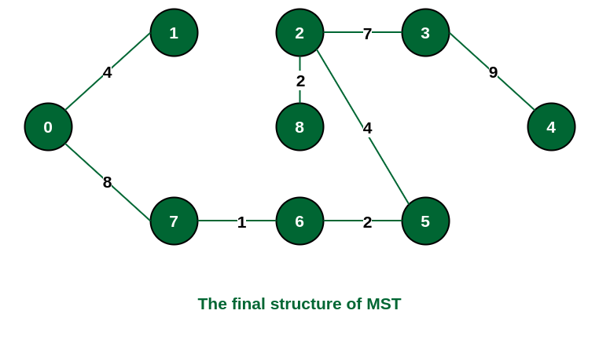

